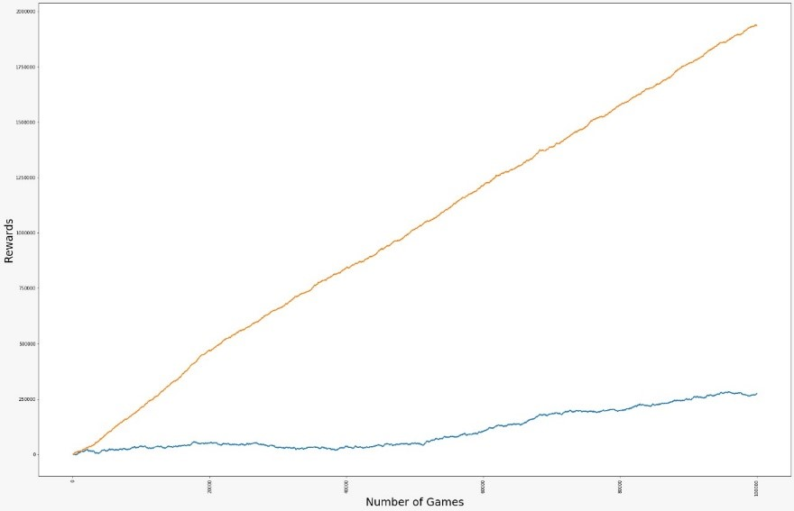

# 2020Fall_projects
Introduction:
The aim of the project was to design a game which is equally profitable to club as Black jack and give the player decent chance of winning.

Assumptions:

•	Player decides to takes a stand at a score greater than or equal to 15  
•	Dealer decides to take a stand at a score greater than or equal to 17 or he is currently winning more than or equal to half his bets against the players 
•	No Split in the game  
•	No Double in the game  
•	No Insurance around the bet

Random Variables:

•	Number of Players: Discrete Random  
•	Cards distributed to players: Uniform Distribution  
•	Players Bet: Uniform Distribution  

Variations:
•	Variable Target Score  
This help to change the target score of the game from 21 to something else.   
•	If Game Should have Head Cards or not   
It help to determine if the game should have head face cards or not.   
•	Variable Value of Head Cards  
Define the value of head cards other than 10.  
•	Player cards are disclosed at the end of the game  
Dealer can't know the cards of player till the end of the game.  
•	Blackjack Reward  
Changing the perfect black jack reward from 3:2(1.5 times) to something else.   
•	Explosion Card  
The player or dealer who get this card losses  

Hypothesis:

Blue line represents the basic black jack game
Orange line represents the game with the specific variations

1 - There will be no change in the dealer’s chances of winning, if the cards of both the player and dealer are disclosed at the end of the game. 

We reject the null hypothesis. 

2 - There will be no change in the dealer’s chances of winning, if the player loses by receiving a Blackjack in the first two dealt cards.

We reject the null hypothesis. 

3 - The players chances of winning does not change when the chosen head card value comes closer to the target score.

We reject the null hypothesis.

4 -There will be no change in the player’s chances of winning, When the target is increased or decreased over the default value of 21, keeping the other parameters constant

We reject the null hypothesis.

NEW GAME:
A game created with different combination of parameters which is a potentially good game to be played in a club along with black jack

Number of simulations: 100000
Target Score: 32
Head Card: True
Head Card Value: 12
Should the Dealer be given the advantage: True
Perfect Blackjack Reward: 200
Explosion card: True

Reference:
https://www.youtube.com/watch?v=5bWpnABkU-Y&ab_channel=CrazyVegasOnlineCasino  
https://www.247blackjack.com/  
https://uiuc-ischool-dataviz.github.io/is445AOG_fall2020/week05/  
http://datagenetics.com/blog/march62020/index.html  
https://www.888casino.com/blog/blackjack-strategy-guide/how-to-play-blackjack   
https://www.youtube.com/watch?v=5bWpnABkU-Y&ab_channel=CrazyVegasOnlineCasino   
https://stackoverflow.com/questions/6181935/how-do-you-create-different-variable-names-while-in-a-loop   
https://www.geeksforgeeks.org/print-without-newline-python/   
https://www.compart.com/en/unicode/U+1F4A3   
https://www.youtube.com/watch?v=IsklrLQE88Y&ab_channel=AllTech   
https://www.bowl.com/rules/Rules_Home/USBC_Playing_Rules/

    
    
